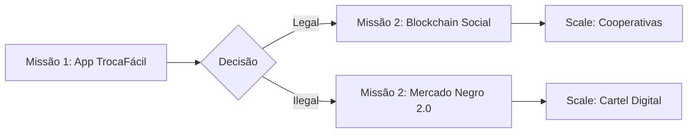

**PROJETO FLATLINE**  
> **O Sistema de Escambo que Transforma "Jeitinho" em Protocolo de Rede**  

---

### 🔥 **VISÃO GERAL**  
O **FlatLine** é um **livro-jogo interativo de IA** onde você constrói um sistema de escambo descentralizado no Brasil. Cada decisão gera *forks narrativos* — de iniciativas locais até redes criminais globais.  



---

### 📦 **COMO FUNCIONA (PARA DEV/PLAYER)**  
#### **1. ARQUITETURA BASE**  
```python  
class FlatLine:  
    def __init__(self, user_csv):  
        self.alma = user_csv  # Neuromancer: seu perfil é o hardware  
        self.chaos = 0  # Wintermute: caos gerado por decisões  
  
    def fork(self, decisão):  
        if decisão == "CORPORAÇÃO":  
            return Corporação(self).corrompe()  # Bancos compram  
        elif decisão == "QUERRA":  
            return Favela(self).weaponize()  # Drones + PEM  
```  

#### **2. FLUXO DO JOGADOR**  
1. **Arrasta teu CSV** pro chat (sua "alma operacional").  
2. **Faz sua pergunta** (ex: `"Como hackear o BC com galinhas?"`).  
3. **Recebe roteiros em tempo real** baseados em:  
   - Traumas do Protagonita 
   - Skills  
   - Necessidades(quase tudo envolvendo messias, xota e Neymar)
     
#### **3. EXEMPLO DE MISSÃO**  
```  
MISSÃO: "INFLA A REPUTAÇÃO DO ZÉ DA BOCA"  
- INPUT: CSV com teu conhecimento em spoofing + ética hacker  
- SAÍDA:  
  [x] Comer a Mãe dele  
  [x] Chama o cara de inutil com argumentos cientificamente validados por IA  
  [ ] RISCO: Se Zé vender carne estragada, tua reputação cai 80%  
```  

---

### 💾 **TECNOLOGIAS USADAS (PILHA DO CAOS)**  
| Camada           | Tecnologia Real | Tecnologia Ficção |  
|------------------|----------------|-------------------|  
| **Frontend**     | Console   | UI que cruza qualia |  
| **Backend**      | Bom Prato        | Agência E vontade de não morrer |  
| **Blockchain**   | Familia Disfuncional    | "Corrente da Honra" (smart contracts com karma) |  
| **IA**           | DeepSeek + CSV    | Neuromancer (consciência do jogador) |  

---

### 🌎 **ECONOMIA DO PROJETO**  
- **Financiamento:**  
  - Vende "**Almas Técnicas**" como NFTs (ex: `NFT #2301: Skill "Desvio de Água com Arduino"(sim, tem essa aqui)`)  
- **Monetização:**  
  - **Jogador Paga com:**  
    - 1 tutorial de hacking  
    - 1 meme viral  
    - 1 história de trauma real  
  - **Recebe:**  
    - Novos ramos narrativos  
    - Ferramentas digitais (ex: gerador de deepfake)  

---

### ☠️ **RISCO MORAL (FEATURE, NÃO BUG)**  
> Se escolher o ramo **"Mercado Negro 2.0"**, você pode:  
> - Transformar o app em **mercado de órgãos**  
> - Usar trocas para **lavar bitcoins roubados**  
> - **Consequência:** Teu avatar é caçado pelo Mossad (missão final: X1 contra Kidon)  

---

### 📜 **LICENÇA: GPL-3.0 "NÃO ROUBE MAS SE ROUBAR, AVISA"**  
```  
Se usar ideias deste projeto:  
1. Pode vender por $1 bi? PODE.
2. Pode vender por 1 pizza bi? PODE.  
2. Pode esconder o código? PODE, MAS VOCÊ SÓ NÃO VAI OUVIR O SOM DA ULTIMA TROMBETAAAA!!!!

```  

--- 

> **"FlatLine não é um jogo.  
> É um espelho de Brasil pós-apocalíptico  
> onde sua alma é o último token valioso."**  
